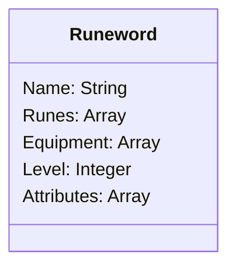

# java-runewords-api

Java RESTful API for saving information about runewords in Diablo 2 and related games. Developed during DIO's Santander Bootcamp 2023 FullStack Java+Angular.

## Class Diagram

